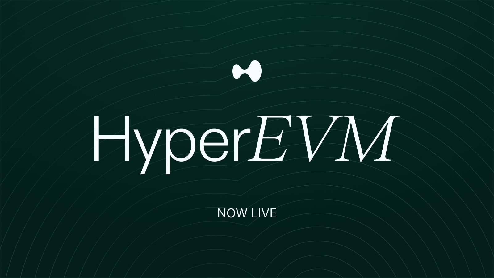

# Clawberto HyperEVM Skills

HyperEVM transaction tracing and execution-planning skills for OpenClaw-style workflows.



## Main Skill

- `skills/trace-hyperevm-wallet`

## What It Covers

- Full wallet history on HyperEVM (normal, internal, token transfers).
- Transaction inspection and sender attribution support.
- Network constants: Chain ID `999`, RPC `https://rpc.hyperliquid.xyz/evm`.
- Non-custodial transaction planning (`transfer-plan`) with nonce/gas/fee checks.
- Optional Hyperliquid perp context and exposure checks (`quote`, `positions`).

## Quick Start

```bash
node skills/trace-hyperevm-wallet/scripts/hyperevm_scan_chat.mjs "hype network"
node skills/trace-hyperevm-wallet/scripts/hyperevm_scan_chat.mjs "hype positions HL:0x..."
node skills/trace-hyperevm-wallet/scripts/hyperevm_scan_chat.mjs "hype transfer-plan HL:0xFrom... HL:0xTo... --amount 0.01"
```
